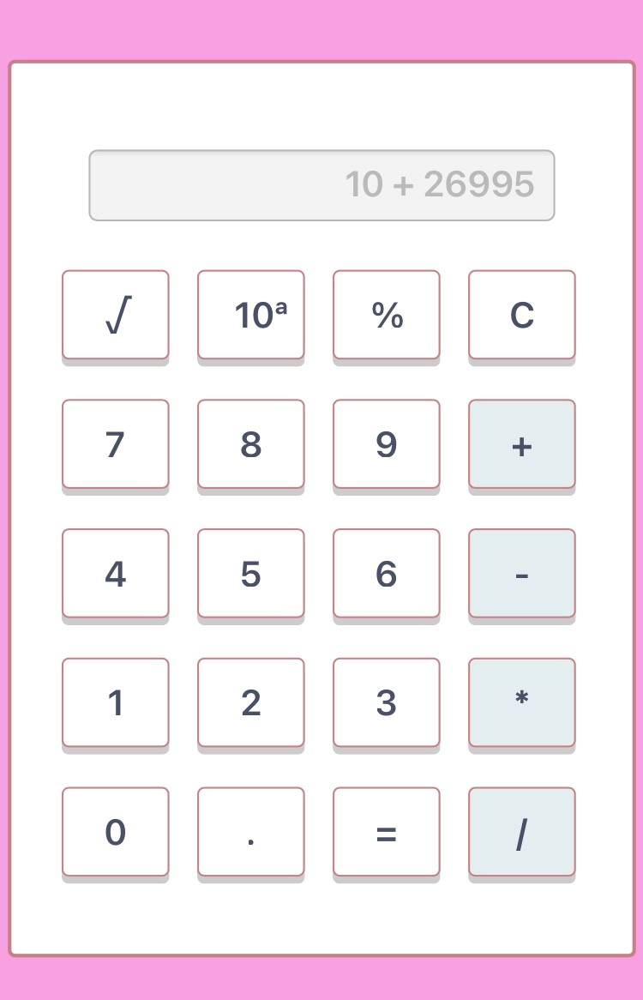

# Calculator
Wee usd what we know about html, css and javascript. So we decided to build a simple calculator app. At the end of this challenge I can say that I'm able to generate a simple app using the DOM and events.
 
## Screenshot

## Tech/framework used

<b>Built with</b>
- [Visual Studio Code](https://visualstudio.microsoft.com/)
- HTML
- CSS 
- JAVASCRIPT

## Features
  This simple calculator can do addition, subtraction, multiplication, and division. It can handle exponential operations, roots, percentage operations.

## How to use?
[Click here and use it like your regular calculator](https://agkabongo.github.io/calculator/)

## Credits 
Voir énoncé ci-joint

[Hopper-1-25](https://github.com/becodeorg/bxl-hopper-1-25/blob/master/The%20Hill/projects/1.calculator/readme.md)